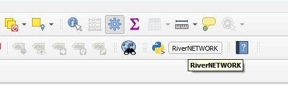
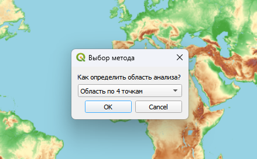
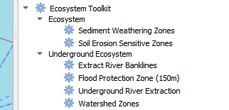
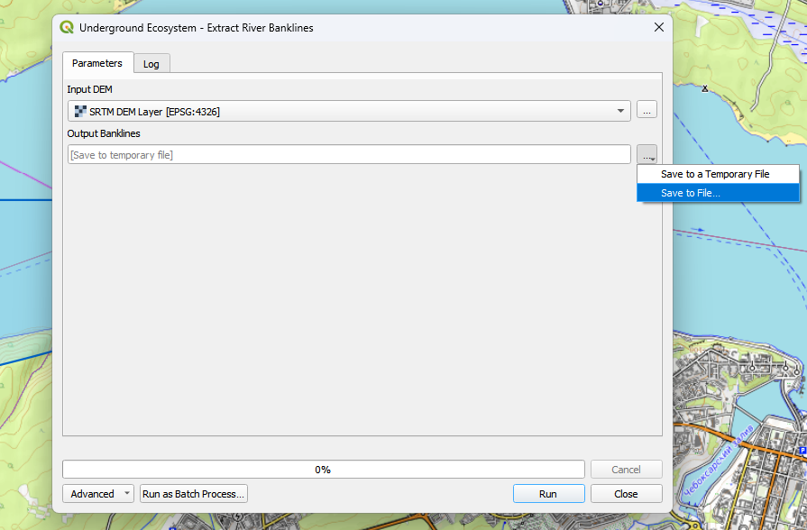
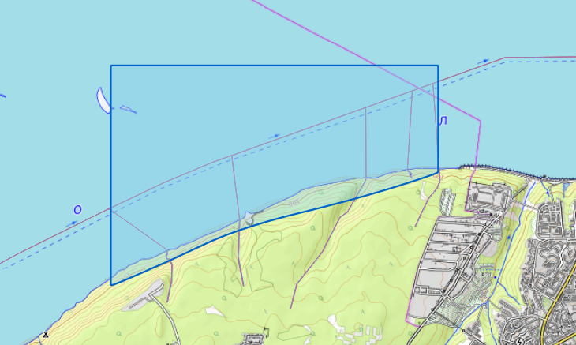
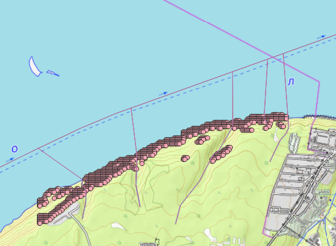
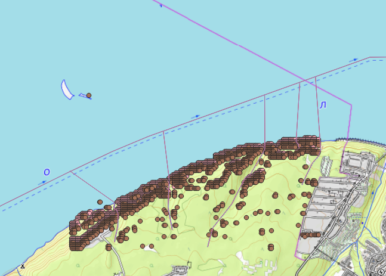

# Underground Ecosystem Toolkit

## Описание проекта

Плагин для QGIS, предназначенный для гидрологического и геоморфологического анализа речных экосистем. Основной фокус — автоматизация выделения подземного русла рек, зон защиты и территорий, подверженных эрозии и выветриванию.

**Цель**: Создание инструментов для идентификации ключевых экосистемных зон речных бассейнов для планирования природоохранных мероприятий и предотвращения наводнений.

## Основные функции

### 1. Извлечение подземного русла реки (Underground River Extraction)
Автоматическое определение подземного русла реки на основе анализа DEM. Идентифицирует пониженные участки рельефа, соответствующие потенциальному подземному стоку.

### 2. Выделение коренных берегов (Extract River Banklines)
Определение коренных берегов реки по рельефу на основе анализа точек резкого изменения высоты вдоль русла.

### 3. Зона защиты от наводнений (Flood Protection Zone)
Построение водоохранной зоны шириной 150 метров от подземного русла для предотвращения наводнений и защиты прибрежных территорий.

### 4. Зоны эрозии почв (Soil Erosion Sensitive Zones)
Выделение территорий, склонных к водной эрозии, на основе анализа уклонов местности. Используется для планирования противоэрозионных мероприятий.

### 5. Зоны выветривания осадков (Sediment Weathering Zones)
Идентификация зон интенсивного выветривания осадочных пород на водоразделах на основе анализа рельефа и уклонов.

## Требования

- **QGIS**: версия 3.22 или выше
- **Python**: 3.x (встроен в QGIS)
- **Зависимости**: NumPy (включен в QGIS)

## Установка

### Способ 1: Через менеджер плагинов QGIS

1. Откройте QGIS → `Плагины` → `Управление и установка плагинов`
2. Перейдите на вкладку `Установка из ZIP`
3. Выберите архив `underground-ecosystem-toolkit.zip`
4. Нажмите `Установить плагин`

### Способ 2: Ручная установка

1. Скопируйте папку `underground-ecosystem-toolkit` в директорию плагинов QGIS:
   - **Windows**: `C:\Users\<username>\AppData\Roaming\QGIS\QGIS3\profiles\default\python\plugins\`
   - **macOS**: `~/Library/Application Support/QGIS/QGIS3/profiles/default/python/plugins/`
   - **Linux**: `~/.local/share/QGIS/QGIS3/profiles/default/python/plugins/`
2. Перезапустите QGIS
3. Включите плагин: `Плагины` → `Управление и установка плагинов` → `Установленные`

### Проверка установки

После установки алгоритмы доступны в панели обработки:
`Обработка` → `Инструменты` → `Ecosystem Toolkit`

## Использование

### Базовый рабочий процесс

1. **Подготовка данных**: Загрузите DEM (цифровую модель рельефа) в формате GeoTIFF (Используется плагин RiverNetwork)

2. **Запуск алгоритма**: Откройте `Обработка` → `Инструменты` → `Ecosystem Toolkit`

3. **Выбор функции**: Выберите один из доступных алгоритмов
4. **Указание параметров**: Выберите входной DEM и путь для сохранения результата

5. **Выполнение**: Нажмите `Выполнить` и дождитесь завершения обработки

### Описание алгоритмов

#### 1. Underground River Extraction

**Вход**: DEM (растр)  
**Выход**: Shapefile с линейной геометрией подземного русла  
**Назначение**: Автоматическое выделение потенциального подземного русла реки

#### 2. Extract River Banklines

**Вход**: DEM (растр)  
**Выход**: Shapefile с линиями коренных берегов  
**Назначение**: Определение границ коренных берегов реки

#### 3. Flood Protection Zone (150m)

**Вход**: Линия русла реки (вектор)  
**Выход**: Shapefile с полигоном защитной зоны  
**Назначение**: Создание буферной зоны 150м для защиты от наводнений

#### 4. Soil Erosion Sensitive Zones

**Вход**: DEM (растр)  
**Выход**: Shapefile с полигонами зон эрозии  
**Назначение**: Выделение территорий, подверженных водной эрозии

#### 5. Sediment Weathering Zones

**Вход**: DEM (растр)  
**Выход**: Shapefile с полигонами зон выветривания  
**Назначение**: Идентификация зон интенсивного выветривания
